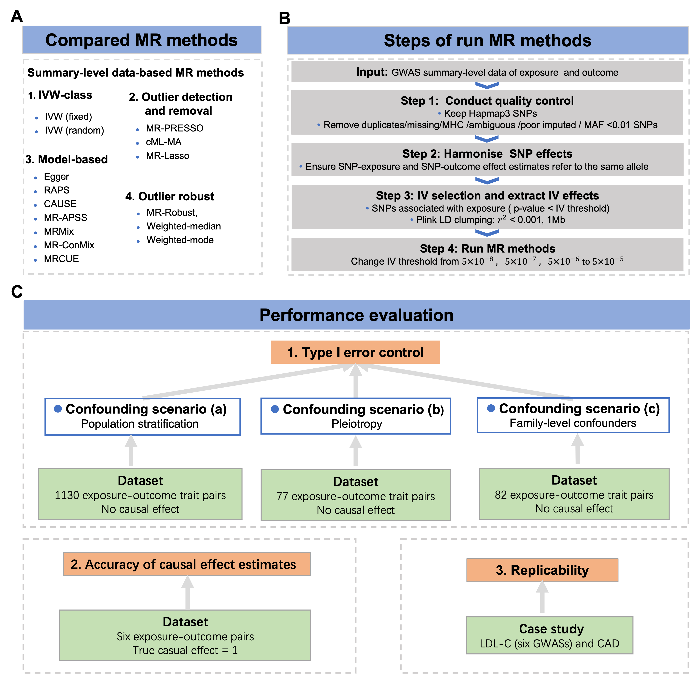

# Benchmarking Mendelian Randomization methods for causal inference using genome‐wide association study summary statistics
## The experimental design for benchmarking MR methods
We present a benchmarking analysis of MR methods for causal inference with real-world genetic datasets. Our focus is on MR methods that utilize GWAS summary statistics as input, as they do not require access to individual-level GWAS data and are widely applicable. Specifically, we consider 15 MR methods, including the standard IVW (fixed) and IVW (random) and 13 other advanced MR methods: Egger, RAPS,  Weighted-median, Weighted-mode, MR-PRESSO, MRMix, cML-MA, MR-Robust, MR-Lasso, MR-CUE, CAUSE, MRAPSS and MR-ConMix (Figure A). The procedure for running the MR methods is outlined in Figure B.  To assess the performance of these MR methods, we utilized real-world datasets and focused on three key aspects: type I error control, the accuracy of causal effect estimates, and replicability (Figure C).

## Datasets
The five datasets used in the MR benchmarking study can be downloaded here.
### Dataset for evaluation of type I error control in confounding scenario (a): Population stratification (Dataset 1)
[Formatted GWASs for exposures]();   [Formatted GWASs for outcomes]();  [Data after IV selection]();  
[Genetic correlation estimates]();   [Estimated MR-APSS background parameters]().

### Dataset for evaluation of type I error control in confounding scenario (b): Pleiotropy (Dataset 2)
[Formatted GWASs for exposures]();   [Formatted GWASs for outcomes]();  [Data after IV selection]();  
[Genetic correlation estimates]();   [Estimated MR-APSS background parameters]().

### Dataset for evaluation of type I error control in confounding scenario (c): Family-level confounders (Dataset 3)
[Formatted GWASs]();   [Tested Trait pairs]();  [Data after IV selection]();  
[Genetic correlation estimates]();   [Estimated MR-APSS background parameters]().

### Dataset for evaluation of the accuracy of causal effect estimates (Dataset 4)
[Formatted GWASs for exposures]();   [Formatted GWASs for outcomes]();   [Data after IV selection]();  
[Genetic correlation estimates]();   [Estimated MR-APSS background parameters]().

### Dataset for evaluation of replicability (Dataset 5)
[Formatted GWASs for exposures]();   [Formatted GWASs for outcomes]();   [Data after IV selection]();  
[Genetic correlation estimates]();   [Estimated MR-APSS background parameters]().

In each dataset, the GWAS summary-level data files for each exposure or outcome trait (after quality control) and the summary statistics after IV selection for each trait pair are available.

## R code
### Install required packages
#install.packages("devtools")
#install.packages("remotes")

devtools::install_github("gqi/MRMix")

devtools::install_github("xue-hr/MRcML")

devtools::install_github("jean997/cause@v1.2.0")

devtools::install_github("rondolab/MR-PRESSO")

install.packages("MendelianRandomization")

devtools::install_github("YangLabHKUST/MR-APSS")

devtools::install_github("QingCheng0218/MR.CUE@main")

remotes::install_github("MRCIEU/TwoSampleMR")

devtools::install_github("qingyuanzhao/mr.raps")

install.packages(“robustbase”)

### Run MR Methods
We perform IV selection for each trait pair in each dataset.
The R code for IV selection is available in [IV_selection.R](https://github.com/YangLabHKUST/MRbenchmarking/blob/main/IV_selection.R).

We then applied each compared method using the dataset after IV selection.
The R codes for running the 15 MR methods for each dataset are available in [main_run_MR_methods.R](https://github.com/YangLabHKUST/MRbenchmarking/blob/main/main_run_MR_methods.R).
To run the codes of *main_run_MR_methods.R*, you must load the required packages and the R functions in the folder [Rfuncs](https://github.com/YangLabHKUST/MRbenchmarking/tree/main/Rfuncs). 

## Results of MR methods
[Results for dataset 1]();  
[Results for dataset 2]();  
[Results for dataset 3]();  
[Results for dataset 4]();  
[Results for dataset 5](). 

## Reference
Xianghong Hu, Mingxuan Cai, Jiashun Xiao, Xiaomeng Wan, Zhiwei Wang, Hongyu Zhao, and Can Yang, Benchmarking Mendelian Randomization methods for causal inference using genome‐wide association study summary statistics

## Contact information
Please feel free to contact Xianghong Hu (maxhu@ust.hk) or Prof. Can Yang (macyang@ust.hk) if any questions.
