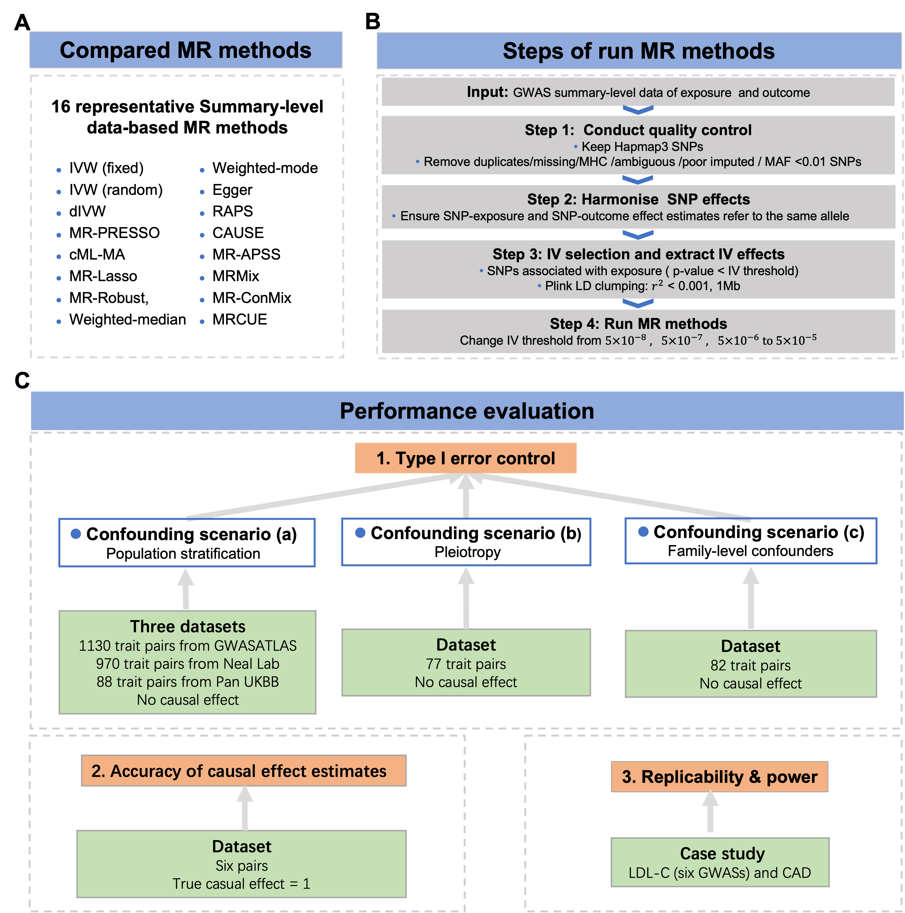

# Benchmarking Mendelian Randomization methods for causal inference using genome‐wide association study summary statistics
## The experimental design for benchmarking MR methods
We present a benchmarking analysis of MR methods for causal inference with real-world genetic datasets. Our focus is on MR methods that utilize GWAS summary statistics as input, as they do not require access to individual-level GWAS data and are widely applicable. Specifically, we consider 16 MR methods, including the standard IVW (fixed), IVW (random) and 14 other advanced MR methods: dIVW, Egger, RAPS,  Weighted-median, Weighted-mode, MR-PRESSO, MRMix, cML-MA, MR-Robust, MR-Lasso, MR-CUE, CAUSE, MRAPSS and MR-ConMix (Figure A). The procedure for running the MR methods is outlined in Figure B.  To assess the performance of these MR methods, we utilized real-world datasets and focused on three key aspects: type I error control, the accuracy of causal effect estimates, replicability, and power (Figure C).

## Datasets
The datasets used in the MR benchmarking study can be downloaded here.

Dataset 1: GWASATLAS Dataset for evaluation of type I error control in confounding scenario (a): Population stratification
<!-- [Tested trait pairs](https://gohkust-my.sharepoint.com/:t:/g/personal/maxhu_ust_hk/ET-ZfKHDuJZMr11_4OqmCiMBOkqcvemSyI-2nsZ0ofCMlQ?e=e8FxtI);-->
[GWASs for exposures](https://gohkust-my.sharepoint.com/:u:/g/personal/maxhu_ust_hk/EblwNZLAorRAvCLbvYugudEBaGtWc72q2HrhAvGkCHTmaA?e=ciE3Q2);
[GWASs for outcomes](https://gohkust-my.sharepoint.com/:u:/g/personal/maxhu_ust_hk/EQdc-MQQeLZKn7G2Oj9N30sBuuZCZ4c3LCjgi92NokmAOw?e=dXcdr7);
[IV data for MR analysis](https://gohkust-my.sharepoint.com/:u:/g/personal/maxhu_ust_hk/EQqGIPxZVaxNsWdelJeCO7IB4bbgwy8m31_b58JZFFO0eA?e=nkxQRb);
<!-- [Estimated MR-APSS background parameters](https://gohkust-my.sharepoint.com/:u:/g/personal/maxhu_ust_hk/EaBGM-8E091EqKI9S-VCH4AB1Rz9DGbKFHATedJCHVJocg?e=cv3jpw). -->

Dataset 2: the Neal Lab Dataset for evaluation of type I error control in confounding scenario (a): Population stratification
<!-- [GWASs](); [IV data for MR analysis]()](). --> 

[Dataset 3: the Pan UKBB Dataset for evaluation of type I error control in confounding scenario (a): Population stratification]()
<!-- [GWASs]();[Formatted IV data for MR analysis](). --> 

[Dataset 4: the dataset for evaluation of type I error control in confounding scenario (b): Pleiotropy (Dataset 4)]()
<!--[Tested trait pairs](https://gohkust-my.sharepoint.com/:t:/g/personal/maxhu_ust_hk/EcfowDL7-JJNqebh-sKP_o4BCvfhd0j1JafV1-RPUwzVHg?e=dknaxS);
[GWASs](https://gohkust-my.sharepoint.com/:u:/g/personal/maxhu_ust_hk/EfN6LoAoCQVAgqcVFS5SCcQB4DykLekSbpUO-nYyUSqKww?e=cV6RWR); 
[IV data for MR analysis](https://gohkust-my.sharepoint.com/:u:/g/personal/maxhu_ust_hk/EewHQYJ6mThClhtp-3J6M_kBICgfEWWz628vFY54UhtzZw?e=GiHfTr);
[Estimated MR-APSS background parameters](https://gohkust-my.sharepoint.com/:u:/g/personal/maxhu_ust_hk/Ed13MkxRldxFqM_Zq5Z0RskBRVGioe2sIXosP0gidmqYog?e=VxWEyl).-->

[Dataset 5: the dataset for evaluation of type I error control in confounding scenario (c): Family-level confounders]() 
<!--[Tested Trait pairs](https://gohkust-my.sharepoint.com/:t:/g/personal/maxhu_ust_hk/EZcfheV83pNIrfCd7wVLzNkBcD6gCg3tY-w9bZ5Aqx8kEQ?e=uBqikV);
[GWASs](https://gohkust-my.sharepoint.com/:u:/g/personal/maxhu_ust_hk/Efflau1WW7VAhgyBEaZsw2IBh59CUv7HLdbCE-cAPJuesw?e=zF3Ldc);
[IV data for MR analysis](https://gohkust-my.sharepoint.com/:f:/g/personal/maxhu_ust_hk/EjIntlAlD8dLqe2zte2EVbgBWECWw6j12Jm9qjg_dn9hAA?e=Xkk021);
[Estimated MR-APSS background parameters](https://gohkust-my.sharepoint.com/:f:/g/personal/maxhu_ust_hk/Eh-oXPZUVuNMqEJU6LrvQfEBXHsB3qb2QztlC3SCTxsgTg?e=9PjOT4).-->

[Dataset 6: the dataset for evaluation of the accuracy of causal effect estimates]()
<!--[Tested Trait pairs](https://gohkust-my.sharepoint.com/:t:/g/personal/maxhu_ust_hk/EUPa_icc26dNuonjOG6Ia7EBu9Mu9vjT3TvcCYr8qWHNYQ?e=CQwwIx);
[GWASs](https://gohkust-my.sharepoint.com/:u:/g/personal/maxhu_ust_hk/EVGtR-AH6WBCvmleRgAmZJIBYDK8tty61YxbeFobnMRCRg?e=QUPw5v);
[IV data for MR analysis](https://gohkust-my.sharepoint.com/:f:/g/personal/maxhu_ust_hk/EuMU6Cg9EzdFjVaVfqoKi7EBToxnCL0zw4bU3gPnRdwwxg?e=fpiyHW);
[Estimated MR-APSS background parameters](https://gohkust-my.sharepoint.com/:f:/g/personal/maxhu_ust_hk/EpzSQnpvxFFJge-I1nm5Fz4Bx2bLVQe_NDpeVFBB6Fpp6g?e=Wbr904).-->

[Dataset 7: the dataset for evaluation of replicability]()
<!--[Tested Trait pairs](https://gohkust-my.sharepoint.com/:t:/g/personal/maxhu_ust_hk/EU5AwvS3S-FOriBAL2c0biABY4J7zQC1me9Y0r4KF4a4Bw?e=UocM5h);
[GWASs](https://gohkust-my.sharepoint.com/:u:/g/personal/maxhu_ust_hk/EcfHZhJfqrxLiBiIV8W5BWgBJgIBklOJcc0ebggGqCD4wg?e=GJYoAF);
[IV data for MR analysis](https://gohkust-my.sharepoint.com/:f:/g/personal/maxhu_ust_hk/EnBPaVHrLEVOg01xbqx-QJwB-cTxFUltKNspQyKxdlSdQw?e=OCMexB);
[Estimated MR-APSS background parameters](https://gohkust-my.sharepoint.com/:f:/g/personal/maxhu_ust_hk/EkhFN-xhi8lMiLzUH2L4FqEBzOEyirIU5p6bRNZTIBDwMw?e=c5xRRx).-->

Each of the datasets contains the following files:  
(1) "Tested Trait pairs": the exposure-outcome trait pairs to be analyzed;  
(2) "GWASs" refers to the formatted GWAS summary-level data files after quality control;  
(3) "IV data for MR analysis" refers to the summary statistics of LD clumped IV sets for each trait pair tested which can be directed used for MR analysis;    
(5) "Estimated MR-APSS background parameters" are the estimated background parameters "Omega" and "C" which will be used for MR estimation in MR-APSS.  

Note:  
Genetic correlations are estimated LDSC using the function "est_paras" in R package MR-APSS;    
The details on quality control of GWAS summary statistics, formatting GWASs, and  LD clumping for IV selection can be found on the [MR-APSS software tutorial]((https://github.com/YangLabHKUST/MR-APSS/blob/master/MRAPSS_Rpackage_Tutorial.pdf)) on MR-APSS [GitHub](https://github.com/YangLabHKUST/MR-APSS) website.

## R code
### Install required packages
#install.packages("devtools")
#install.packages("remotes")

devtools::install_github("gqi/MRMix")

devtools::install_github("xue-hr/MRcML")

devtools::install_github("jean997/cause@v1.2.0")

devtools::install_github("rondolab/MR-PRESSO")

install.packages("MendelianRandomization")

devtools::install_github("YangLabHKUST/MR-APSS")

devtools::install_github("QingCheng0218/MR.CUE@main")

remotes::install_github("MRCIEU/TwoSampleMR")

devtools::install_github("qingyuanzhao/mr.raps")

install.packages(“robustbase”)

### Run MR Methods
We perform IV selection for each trait pair in each dataset.
The R code for IV selection is available in [IV_selection.R](https://github.com/YangLabHKUST/MRbenchmarking/blob/main/IV_selection.R).

We then applied each compared method using the dataset after IV selection.
The R codes for running the 15 MR methods for each dataset are available in [main_run_MR_methods.R](https://github.com/YangLabHKUST/MRbenchmarking/blob/main/main_run_MR_methods.R).
To run the codes of *main_run_MR_methods.R*, you must load the required packages and the R functions in the folder [Rfuncs](https://github.com/YangLabHKUST/MRbenchmarking/tree/main/Rfuncs). 

## Results of MR methods
[Results for dataset 1](https://gohkust-my.sharepoint.com/:x:/g/personal/maxhu_ust_hk/EX6Z2H7z0tlJulUViaU8KBoBrS2imAI-Bi05k_A5uF5rHA?e=i2Kumy);  
[Results for dataset 2]();  
[Results for dataset 3]();  
[Results for dataset 4](https://gohkust-my.sharepoint.com/:x:/g/personal/maxhu_ust_hk/EeotVVzGpZ1GsOqEDe2aBlkB2OblHcCNoFBRH9JrIG1Paw?e=dm5YEZ);  
[Results for dataset 5](https://gohkust-my.sharepoint.com/:x:/g/personal/maxhu_ust_hk/EVA9S1tqz0pPm1Qdo8-0Y6gB2m0_1Vtj8v0oTKH-fKDW5g?e=LKaUTo);  
[Results for dataset 6](https://gohkust-my.sharepoint.com/:x:/g/personal/maxhu_ust_hk/EVN1WnPMLFJAhHlXoq8eOV0BI2O4BxyklawLKbFiv6qVag?e=RMmFri);  
[Results for dataset 7](https://gohkust-my.sharepoint.com/:x:/g/personal/maxhu_ust_hk/Ea_arSbxacpKj48wjzk9qykBBXYxOBld1gdFTMuBu-IFKg?e=qCZDau). 

## Reference
Xianghong Hu, Mingxuan Cai, Jiashun Xiao, Xiaomeng Wan, Zhiwei Wang, Hongyu Zhao, and Can Yang, Benchmarking Mendelian Randomization methods for causal inference using genome‐wide association study summary statistics, https://medrxiv.org/cgi/content/short/2024.01.03.24300765v1.

## Contact information
Please feel free to contact Xianghong Hu (maxhu@ust.hk) or Prof. Can Yang (macyang@ust.hk) if any questions.
